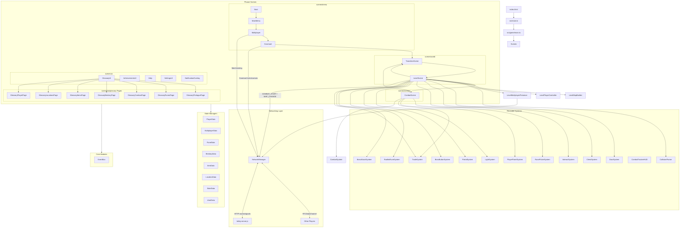

# Architecture & Folder Structure

This document outlines the architecture, systems, and folder layout of **G.L.O.S.S.A.R.Y.**

---

## Folder Directory Details

### 📂 Root Directory
* `lobby-server.js` - A lightweight Node.js HTTP server used for multiplayer room discovery and WebRTC signaling. Tracks room heartbeats, stores short-lived offer/answer/ICE messages, and cleans up stale state.
* `package.json` - Project metadata, build commands, and npm script dependencies.
* `index.html` - The HTML entry point for the Vite bundler.

---

### 📂 src/game (Core Setup)
The primary source code built with Phaser 3 and TypeScript.
* `main.ts` - Instantiates the global Phaser Game configuration. Registers all scenes and configures `Scale.FIT` for viewport responsiveness.
* `constants.ts` - Houses design tokens, HSL palette mapping, control layouts (`InputKeys`), frame boundaries, and typography.
* `EventBus.ts` - Global custom event bus orchestrating decoupled state communication across scenes.
* `NetworkManager.ts` - Decoupled native WebRTC networking manager. Uses `RTCPeerConnection` data channels for peer gameplay messages and the local lobby server for room discovery/signaling.

---

### 📂 src/game/data (State Management)
State engines implemented as singletons that preserve progression and manage local storage.
* `BestiaryData.ts` - Tracks discovered enemies and manages bestiary details.
* `ItemData.ts` - Catalog of the 12 collectible items, buying cost, rarity tiers, and description lore.
* `LocationData.ts` - Tracks visited settlements, boss maps, and unlocked portal coordinates.
* `MultiplayerData.ts` - Room metadata, local hosted/joined room state, and shared rune seed generation for multiplayer runs.
* `PlayerData.ts` - Core attributes of the player (HP, maxHP, Covenants, Gemstones, active stat trades, and inventory).
* `RuneData.ts` - Manages the player's runic vocabulary, discoveries, and combinatorial chain resolver calculations.
* `SlateData.ts` - Defines translation slate puzzles and lore fragments for the Glossary slate pages.
* `UserData.ts` - Tracks achievements, control mappings, audio levels, and permanent player unlocks.

---

### 📂 src/game/combat (Combat Core Engine)
Encapsulates all logic and interfaces relating to combat.
* `CombatSystem.ts` - Central math and phase state machine. Processes rounds, status effects, damage calculations, and Covenant ability expenditures.
* `CombatEncounter.ts` - Defines encounter payloads, player cohorts, enemy selection, and combat start data.
* `CombatTurnController.ts` - Coordinates player/enemy turn sequencing.
* `CombatEndController.ts` - Resolves combat completion, rewards, and return transitions.
* `CombatSceneAssets.ts` / `CombatFrameUtils.ts` - Asset and frame helpers for the combat scene.
* `CombatHUD.ts` - Manages the combat screen text displays, combat phase banners, HP/shield bars, and real-time damage formula previews.
* `CombatInventoryUI.ts` - Renders combat item access.
* `EnemyAnimator.ts` / `EnemyAnimData.ts` - Enemy animation definitions and runtime animation helper logic.
* `StatusEffectUI.ts` - Renders interactive, animated status badges above players and enemies indicating stacks, durations, and mechanics on hover.

---

### 📂 src/game/systems (Game Exploration & UI Systems)
Reusable modules representing dedicated interactable game components.
* `BossButtonSystem.ts` - Spawns and manages interactive boss challenge triggers at the end of exploration maps.
* `BossAttackSystem.ts` - Runs Summit boss arena hazards, pillar damage, and pressure patterns.
* `ChestSystem.ts` - Processes environmental chest interactions, opening animations, and gemstone reward distribution.
* `CombatTrackerHUD.ts` - Shows completed combat progress feeding the hub/Raidho floor-advance loop.
* `CollisionParser.ts` - Parses complex polyline, polygon, ellipse, and rectangle physics boundaries from Tiled JSON directly into Matter.js bodies.
* `DashSystem.ts` / `DashIndicatorHUD.ts` - Handles exploration dash timing, covenant dash assets, and cooldown UI.
* `DoorSystem.ts` - Renders, animates, and controls locked gates, hold-to-interact sensors, and portal triggers.
* `InteractSystem.ts` - Manages exploration prompts (e.g., "?" or "[E] Interact") that pop up near chests, doors, and NPCs.
* `LightSystem.ts` - Integrates ambient environment overlays representing a long, gradual day/night cycle.
* `MechanicDoorSystem.ts` / `SettlementDoorSystem.ts` - Specialized map doors for mechanic and settlement gates.
* `MerchantSystem.ts` - Handles merchant interactables and shop entry.
* `PipeSystem.ts` - Tracks completed combat energy feeding the Central Hub pipe/Raidho progression.
* `PlayerPanelSystem.ts` - UI panel showing co-op allies, active status effects, and currently constructed rune chains.
* `PortalSystem.ts` - Manages map traversal gates and spatial transition triggers.
* `RaidhoRuneSystem.ts` - Central Hub rune gate. Visualizes pipe charge, gates floor advancement behind three completed combats, broadcasts multiplayer `MAP_CHANGE`, and sends late runs to the Summit.
* `RuneIndicatorSystem.ts` / `SummitBossHUD.ts` - Summit boss state indicators and HUD feedback.
* `RunePickerSystem.ts` - Implements the circular rune picking deck, hand scaling, combo resolution visual effects, and chain locking.
* `SlateInteraction.ts` / `SlateSystem.ts` - Slate interactables and fragment translation minigame entry.
* `TradeSystem.ts` - Powers the interactive trading card carousel interface where players purchase permanent stat upgrades using Gemstones or Special Currency.

---

### 📂 src/game/utils (Lightweight Helpers)
* `AudioManager.ts` - Shared sound effect/music loader and playback helper.
* `Cat.ts` - Easter egg cat character logic.
* `CombatProgress.ts` - Local combat completion persistence used by hub progression.
* `CombatStartSync.ts` - Builds, broadcasts, and launches synchronized multiplayer combat start payloads.
* `DamageOverlay.ts` - Full-screen damage feedback.
* `GodMode.ts` - Debug helper for development builds.
* `LocationDefinition.ts` - Location reveal display scene/helper.
* `SaveReset.ts` - Clears gameplay local storage for a new run.
* `GeometryUtils.ts` - Mathematical utilities enforcing clockwise winding coordinates for Matter.js shapes.
* `ScrambleAnimation.ts` - Handles runic scrambling and character-by-character textual reveal effects.
* `ScreenShake.ts` - Camera shaking feedback for impacts and tremors.
* `TweenUtils.ts` - Standardized ease configurations for cards, sliding books, and UI banners.
* `Vignette.ts` - Adds an atmospheric shadow border enhancing depth in dungeon biomes.

---

### 📂 src/game/scenes (Phaser Game Scenes)

#### 📂 scenes/menu/
* `Boot.ts` - Initial load screen caching raw assets, spritesheets, and font maps.
* `MainMenu.ts` - Title screen featuring neon highlights and option panels.
* `Multiplayer.ts` - Interactive room search browser and matchmaking lobby.
* `Covenant.ts` - Interactive selection altar where players choose their philosophy (Snake, Phoenix, Dragon) and synchronize state.

#### 📂 scenes/world/
* `LevelScene.ts` - Manages the exploration phase, physics world steps, tileset collisions, and interactive objects.
* `level/LevelSceneAssets.ts` - Preloads and ensures exploration player, door, map, and animation assets.
* `level/LevelMapBuilder.ts` - Builds Tiled maps into Matter collision, interactable systems, portals, merchants, boss systems, and map-specific state.
* `level/LevelPlayerController.ts` - Handles exploration movement, animation, stair/slow-zone behavior, and player depth.
* `level/LevelMultiplayerPresence.ts` - Broadcasts local `PLAYER_STATE` packets and renders interpolated remote players on the same map.
* `GameOver.ts` - Death/game-over scene.
* `TransitionScene.ts` - High-quality transition wipes separating exploration, menus, and battles.

#### 📂 scenes/combat/
* `CombatScene.ts` - Operates the active combat overlay, instantiating enemies, triggering damage animations, and coordinating with `CombatSystem` and systems layers.

#### 📂 scenes/ui/
* `Achievements.ts` / `AchievementsUI.ts` - Grid representing badge accomplishments and metadata.
* `ControlsUI.ts` - Keyboard mappings guide.
* `Help.ts` - Comprehensive page showing mechanical guides, rules, and basic controls.
* `ItemModal.ts` - Detailed tooltip modal for inspected trade items.
* `NotificationOverlay.ts` - UI broker distributing discovery popups.
* `Settings.ts` / `SettingsUI.ts` - General gameplay and audio adjustments.
* `GlossaryUI.ts` - The primary lore book. Spawns a beautiful, dual-page book layout that hosts several page scenes.

#### 📂 scenes/ui/glossary/ (Lore Book Pages)
* `GlossaryProloguePage.ts` - Narrative entry introduction recounting the fracturing of language and reality.
* `GlossaryRunesPage.ts` - Discovered rune lexicon showing translations, card types, and descriptions.
* `GlossaryCombosPage.ts` - Combos journal showing unlocked 3-rune legendary combinations.
* `GlossaryBestiaryPage.ts` - List of defeated monsters, models, stats, and tactical advice.
* `GlossaryItemsPage.ts` - Collectible item inventory and lore logging.
* `GlossaryLocationsPage.ts` - Map outlines tracking discovered biomes, settlements, and portals.
* `GlossaryPlayerPage.ts` - Progress dashboard displaying stats, covenant status, gemstone tallies, and trade summaries.

---

## Complete Folder Tree

```text
src/game/
├── EventBus.ts
├── NetworkManager.ts
├── constants.ts
├── main.ts
│
├── combat/
│   ├── CombatEncounter.ts
│   ├── CombatEndController.ts
│   ├── CombatFrameUtils.ts
│   ├── CombatSystem.ts
│   ├── CombatTurnController.ts
│   ├── CombatHUD.ts
│   ├── CombatInventoryUI.ts
│   ├── CombatSceneAssets.ts
│   ├── CombatSceneControls.ts
│   ├── EnemyAnimData.ts
│   ├── EnemyAnimator.ts
│   └── StatusEffectUI.ts
│
├── data/
│   ├── BestiaryData.ts
│   ├── ItemData.ts
│   ├── LocationData.ts
│   ├── MultiplayerData.ts
│   ├── PlayerData.ts
│   ├── RuneData.ts
│   ├── SlateData.ts
│   └── UserData.ts
│
├── systems/
│   ├── BossButtonSystem.ts
│   ├── BossAttackSystem.ts
│   ├── ChestSystem.ts
│   ├── CombatTrackerHUD.ts
│   ├── CollisionParser.ts
│   ├── DashIndicatorHUD.ts
│   ├── DashSystem.ts
│   ├── DoorSystem.ts
│   ├── InteractSystem.ts
│   ├── LightSystem.ts
│   ├── MechanicDoorSystem.ts
│   ├── MerchantSystem.ts
│   ├── PipeSystem.ts
│   ├── PlayerPanelSystem.ts
│   ├── PortalSystem.ts
│   ├── RaidhoRuneSystem.ts
│   ├── RuneIndicatorSystem.ts
│   ├── RunePickerSystem.ts
│   ├── SettlementDoorSystem.ts
│   ├── SlateInteraction.ts
│   ├── SlateSystem.ts
│   ├── SummitBossHUD.ts
│   └── TradeSystem.ts
│
├── utils/
│   ├── AudioManager.ts
│   ├── Cat.ts
│   ├── CombatProgress.ts
│   ├── CombatStartSync.ts
│   ├── DamageOverlay.ts
│   ├── GeometryUtils.ts
│   ├── GodMode.ts
│   ├── LocationDefinition.ts
│   ├── SaveReset.ts
│   ├── ScrambleAnimation.ts
│   ├── ScreenShake.ts
│   ├── TweenUtils.ts
│   └── Vignette.ts
│
└── scenes/
    ├── combat/
    │   └── CombatScene.ts
    ├── menu/
    │   ├── Boot.ts
    │   ├── Covenant.ts
    │   ├── MainMenu.ts
    │   └── Multiplayer.ts
    ├── world/
    │   ├── GameOver.ts
    │   ├── LevelScene.ts
    │   ├── TransitionScene.ts
    │   └── level/
    │       ├── LevelMapBuilder.ts
    │       ├── LevelMultiplayerPresence.ts
    │       ├── LevelPlayerController.ts
    │       └── LevelSceneAssets.ts
    └── ui/
        ├── Achievements.ts
        ├── AchievementsUI.ts
        ├── ControlsUI.ts
        ├── GlossaryUI.ts
        ├── DialogueModal.ts
        ├── Help.ts
        ├── ItemModal.ts
        ├── MerchantShop.ts
        ├── NotificationOverlay.ts
        ├── SlateMinigame.ts
        ├── Settings.ts
        ├── SettingsUI.ts
        └── glossary/
            ├── GlossaryBestiaryPage.ts
            ├── GlossaryCombosPage.ts
            ├── GlossaryItemsPage.ts
            ├── GlossaryLocationsPage.ts
            ├── GlossaryPlayerPage.ts
            ├── GlossaryProloguePage.ts
            └── GlossaryRunesPage.ts
```

---

## System Architecture Diagram


