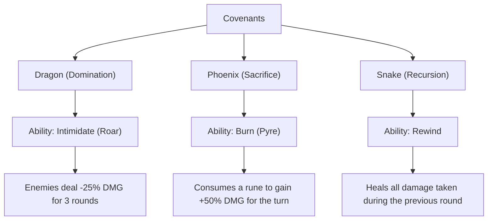

# G.L.O.S.S.A.R.Y. - Game Design Document (GDD)
**Lead Designer & Developer:** Jesse Ricardo Rogerio  
**Last Updated:** May 2026

---

## 1. Executive Summary

### Elevator Pitch
A cooperative, turn-based exploration RPG for 1–3 players. Awoken as nameless Shadows, players explore distinct fractured realms, gather ancient runic vocabulary, master combinations, and ascend together at the Summit to challenge a legendary deity.

### Core Premise
In the spirit of ancient myths and linguistic puzzles, **G.L.O.S.S.A.R.Y.** is a game about reclaiming lost meaning. Players explore a fractured, stylized world, translating forgotten runes into reality-bending combat chains. The interactive **Glossary** serves as the central progression tracker—recording discovered runes, item lore, bestiary entries, and locations. 

---

## 2. Setting & Theme

| Category | Description |
| :--- | :--- |
| **Narrative Theme** | Reclaiming lost identity and meaning through the reconstruction of language. |
| **Aesthetic Style** | Glowing runes, stone-carved architecture, rich dark-mode overlays, smooth gradients, and glitchy distortions signaling the fracturing of reality. |
| **Realms** | **Central Hub**: The nexus of worlds.<br>**Desert**: Scorched, ancient sands.<br>**Abandoned**: Rainy, overgrown wasteland.<br>**Mechanic**: Grinding gears and geyser-powered steampunk labs.<br>**The Summit**: The absolute peak where the final god resides. |
| **Genre** | Tactical Turn-Based Combat / Cooperative RPG / Exploration |

---

## 3. Class Systems (The Covenants)

At the start of the journey, players choose a philosophy by binding themselves to one of three powerful **Covenants**. Covenants govern the player's core identity, visual tint, and their unique **Covenant Ability**—which costs **3 Special Currency** to activate in combat.



### The Three Covenants:
1. **Dragon (Domination)**
   - **Color Aesthetic**: Bold, vibrant Orange/Gold.
   - **Ability: Intimidate**: Player lets loose a fearsome *Roar* in combat.
   - **Effect**: Reduces all incoming damage from enemies by **25%** (`damageModifier = 0.75`) for 3 rounds.
2. **Phoenix (Sacrifice)**
   - **Color Aesthetic**: Fiery, luminous Red/Magenta.
   - **Ability: Burn**: Player triggers a blinding *Pyre* by burning a selected rune.
   - **Effect**: Grants the player **+50% Attack Power** (`multiplier *= 1.5`) for the current turn.
3. **Snake (Recursion)**
   - **Color Aesthetic**: Toxic, deep Emerald Green.
   - **Ability: Rewind**: Player bends time backwards.
   - **Effect**: Instantly restores HP equal to the **total damage taken in the last enemy attack phase**.

---

## 4. Turn-Based Combat System

Combat is a highly tactical, turn-based puzzle centered around **Rune Chains**.

```
    [Player Select Phase] ──> [Player Attack Phase] ──> [Enemy Attack Phase] ──> [Resolution Phase]
            │                          │                         │                      │
     Form 1-3 Rune chain        Execute DMG / Heal /     Apply slow/dazed misses   Tick DoTs & decrement
    & use Covenant ability       DEF, trigger status     or weakened regular hits    buff/debuff timers
```

### The Combat Loop
1. **Player Select Phase**: The player reviews their hand of discovered runes. They construct a chain of up to **3 unique runes** and/or invoke their Covenant Ability. A dynamic preview panel displays the precise outcome (damage, healing, defense) before committing.
2. **Player Attack Phase**: The player's chain executes from left to right. Healing and defense (temporary shields) activate immediately, followed by damage and status applications.
3. **Enemy Attack Phase**: Enemies strike their target player. If affected by debuffs like *Slow* or *Dazed*, they may skip turns or miss entirely.
4. **Resolution Phase**: Damage-over-time effects (Venom, Ignite) tick. Active buff and debuff counters decrement. If any combatants have fainted, the system resolves victory or defeat.

### The Precise Damage Formula
$$\text{Damage} = \max\left(1, \lfloor(\text{Player Base Attack} + \text{Rune Power} + \text{Trade Buffs} + \text{Combo Bonus}) \times \text{Multipliers}\rfloor - \text{Enemy Defense}\right)$$

*Note: Enemy defense is ignored entirely if the enemy is afflicted with the **Shatter** debuff.*

---

## 5. Runic Vocabulary & Status Effects

All runes are permanent discoveries cataloged in the Glossary. They fall into three card rarities: **Base** (foundational), **Boost** (amplifying), and **Unique** (reality-bending).

### Runic Vocabulary Index
* **A** (Aether - Base, DMG 8): Raw titantic strength.
* **B** (Basalt - Base, DEF 6): Unyielding defensive barrier.
* **C** (Cipher - Base, DMG 10): Penetrating obsidian spearhead. Applies **Shatter**.
* **D** (Dusk - Boost, HEAL 5): Eclipsed siphoning of life. Applies **Venom**.
* **E** (Echo - Unique, UTIL 0): Eternal repeating loop. Applies **Overcharge** (if chain is exactly 3).
* **F** (Fyre - Base, DMG 12): Primordial volcanic wrath. Applies **Ignite**.
* **G** (Glyph - Boost, DEBUFF 4): Royal marked sentence. Applies **Dazed**.
* **H** (Hallow - Boost, HEAL 7): Solar purging light.
* **I** (Ignis - Unique, DMG 9): Inside combustion spark. Applies **Ignite**.
* **J** (Jinx - Boost, DEBUFF 6): Probability twisting curse. Applies **Venom**.
* **K** (Kael - Base, DEF 8): Resolve and spirit fortifier. Applies **Fortify**.
* **L** (Lux - Boost, HEAL 6): Crystallized star beacon.
* **M** (Morth - Base, DEBUFF 7): Decaying temporal acceleration. Applies **Weaken**.
* **N** (Nyx - Base, DMG 11): Shadow void ambush. Applies **Dazed**.
* **O** (Orin - Boost, BUFF 0): Amplifying choir horn. Applies **Overcharge** (if chain is exactly 3).
* **P** (Prism - Unique, DEF 5): Reflective glass barrier.
* **Q** (Quell - Unique, DEBUFF 3): Sound and will silencer. Applies **Dazed**.
* **R** (Rime - Base, DMG 7): Eternal glacial cold. Applies **Slow**.
* **S** (Sigil - Unique, UTIL 0): Binding warden's seal. Applies **Slow**.
* **T** (Thorn - Base, DEF 9): Retaliatory briar shield.
* **U** (Umbra - Boost, BUFF 4): Obscuring trickster shroud. Applies **Dazed**.
* **V** (Vox - Boost, BUFF 5): Authoritative command.
* **W** (Wyrd - Unique, UTIL 0): Seer's pre-written destiny. Applies **Overcharge** (if chain is exactly 3).
* **X** (Xael - Base, DMG 14): Destructive siege resonance. Applies **Shatter**.
* **Y** (Ymir - Unique, DEF 10): Resilient survival resolve. Applies **Fortify**.
* **Z** (Zeph - Unique, UTIL 0): The forbidden coordinate of the Summit.

---

### Status Effects Encyclopedia

#### Player Buffs
* **Overcharge**: Increases attack damage by **+50%** (`multiplier *= 1.5`) for 2 turns. Triggered by E, O, or W in a 3-rune chain.
* **Fortify**: Boosts all active defense values by **+50%** for 2 turns. Triggered by K or Y.
* **Pyre**: Phoenix Covenant exclusive. Grants **+50%** attack damage for the current turn.
* **Roar**: Dragon Covenant exclusive. Shields the team, forcing enemies to deal **-25%** damage for 3 turns.

#### Enemy Debuffs (Status Ailments)
* **Ignite**: Deals **5** fire damage at the start of each round for 3 turns.
* **Venom**: Deals stacking poison damage equal to `stacks * 2` at the start of each round for 3 turns.
* **Dazed**: Causes the enemy to have a flat **50% chance to miss** their attacks for 2 turns.
* **Shatter**: Bypasses all defense, reducing the target's defense stat to **0** for 2 turns.
* **Slow**: Paralyzes the enemy, forcing them to **skip every other attack** for 3 turns.
* **Weaken**: Debilitates the enemy, reducing their dealt attack damage by **50%** for 2 turns.

---

## 6. Runic Combinations (Combos)

Chaining runes triggers harmonic amplification. Combos are split into two categories:

### A. Predefined Legendary Combos
There are **32 legendary 3-rune combinations** encoded into the game's fabric. Executing one of these grants a huge dynamic power bonus that scales based on the card types in the chain:
$$\text{Bonus Power} = 15 + (\text{Unique Runes} \times 5) + (\text{Base Runes} \times 3) + (\text{Boost Runes} \times 2)$$

#### List of Predefined Combos:
* **Fire Storm** (`F + I + A`): Raging inferno blast.
* **Abyssal Strike** (`N + J + Y`): Relentless void strike.
* **Titan Defense** (`B + K + Y`): Immovable earthen wall.
* **Sun Blessing** (`B + L + S`): Pure solar recovery.
* **Piercing Rift** (`C + O + Q`): Silent defensive rupture.
* **Infinite Echo** (`A + E + W`): Endless repeating strikes.
* **Shattering Cinder** (`X + I + G`): Blasting armor to dust.
* **Phoenix Ward** (`B + P + Y`): Sacred shield of flame.
* **Blood Lust** (`A + D + I`): High-risk siphoning strike.
* **Grave Call** (`N + G + S`): Spectral calling of the abyss.
* **Runic Strike** (`C + K + Q`): Sealed piercing attack.
* **Gale Force** (`A + R + E`): Fast frozen cascade.
* **Star Mending** (`B + O + P`): Celestial shielding and recovery.
* **Iron Guard** (`B + K + P`): Imperial fortress ward.
* **Venomous Fang** (`C + J + Q`): Piercing venom strike.
* **Soul Siphon** (`N + D + W`): Shadows drawing vitality.
* **Cursed Ember** (`F + J + I`): Corrupt burning strikes.
* **Shadow Veil** (`N + U + S`): Complete illusionary shroud.
* **Glacial Aegis** (`B + R + P`): Absolute mirror frost.
* **Divine Light** (`B + H + Y`): Ultimate recovery ward.
* **Void Bridge** (`C + E + S`): Spatial warping puncture.
* **Earth Slam** (`A + K + Y`): Crushing tectonic blast.
* **Phoenix Pyre** (`F + I + P`): Blazing final strike.
* **Temporal Shift** (`A + W + S`): Shifting destiny boundaries.
* **Frozen Wrath** (`R + G + Q`): Calming winter freeze.
* **Lumina Shield** (`B + L + P`): Shielding solar light.
* **Silent Hex** (`C + Q + G`): Disruptive piercing hex.
* **Vanguard Crest** (`B + K + S`): Shielding vanguard warden.
* **Acid Spray** (`C + J + W`): Caustic armor melt.
* **Ember Blast** (`F + O + I`): Pure exploding combustion.
* **Echoing Purify** (`F + E + O`): Repeated volcanic purification.
* **Celestial Will** (`A + V + W`): Sovereignty of the stars.

### B. Generic Combos
If a chain does not match a predefined formula, the system procedurally generates a dynamic title based on the rune card types and primary effect, granting a flat bonus:
* **2-Rune Chains**: Dynamic prefix (e.g. *Dual*, *Resonant*, *Harmonic*) + Flavor name (e.g. *Strike*, *Aegis*, *Blessing*). Grants **+5 Base Power**.
* **3-Rune Chains**: Dynamic prefix (e.g. *Primal Surge*, *Trinity Force*, *Exotic Sync*) + Flavor name. Grants **+10 Base Power**.

---

## 7. World Progression & Systems

### Central Hub & Explorations
The Hub links to three paths leading to distinct biome settlements.
* **Settlements**: Inhabitants trade, recount history, and offer quests. Exploration is crucial to locating Monoliths and chests.
* **Chests**: Contain Gemstones (base currency) and Special Currency.
* **Monoliths**: Large and small runic monuments. Interacting with them initiates a battle in an alternative, high-contrast reality. Defeating the Monolith's guardian permanently **discovers** a rune, adding it to the combat pool.
* **Trades**: Trade points allow players to buy permanent stat boosts (+2 Damage, +2 Defense, +2 Healing) in exchange for Gemstones and Special Currency. 

### Permanent Collectibles (Items)
There are **12 rare and legendary items** found in chests or purchased from elite merchants. Discovered items are preserved in the Glossary's item logs as monuments to progress:
* **Namaste** (Common): Monk beads whispering calm.
* **Runefall** (Epic): Suspiciously familiar thunder hammer.
* **Seraph's Plume** (Legendary): Feather of absolute rebirth.
* **Echojar of The Damned** (Rare): Sealed screaming jar of siphoned souls.
* **Reversed Scale** (Epic): Golden scale of mirrored punishment.
* **404: Not Found** (Rare): Map depicting non-existent coordinates.
* **Schizostone** (Mythic): A rock that talks incessantly.
* **The Archive** (Legendary): Mystical wildcard deck.
* **Second Amendment** (Mythic): Lead projectile dispenser.
* **Fog of War** (Epic): Pixel glasses of absolute confidence.
* **Broken Crown** (Legendary): Crown of a sorrowful mad king.
* **VoidFrame** (Rare): Event horizon vacuum frame.