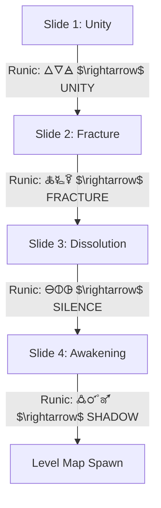

# G.L.O.S.S.A.R.Y. - Lore, Narrative, & Flow Design

This document details the atmospheric narrative structure, opening prologue flow, player spawn animation, post-combat lore delivery, and biome progression tracking systems for **G.L.O.S.S.A.R.Y.**

---

## 1. Narrative Core & Philosophy
**G.L.O.S.S.A.R.Y.** embraces a **silent, environmental storytelling philosophy**. The world is heavy, ancient, and fractured. There are no expansive dialogues or chatting NPCs. Instead, the story is drip-fed directly to players through:
* **Decaying World Biomes**: Visually distinct ruins (Desert, Abandoned, Mechanic) that imply a lost unified age.
* **The Glossary Lore Book**: A physical record that unlocks drawings, names, and poetic fragments as players defeat guardians and collect relics.
* **Translation Slates**: Small fragment puzzles where runic phrases are restored into readable lore, revealing the tower, the covenants, the Merchant, and the Summit parasite.
* **The Scramble Reveals**: Unidentified runic symbols programmatically reorganizing themselves into words of power, indicating the reconstruction of language.

---

## 2. The Silent Prologue: "The Fracturing of Babel"
A slideshow scene that launches immediately after players lock in their Covenants, bridging the waiting room and the active exploration map.



### Visual & Textual Panel Flow
* **Panel 1: The Golden Age of Language**
  * **Visual**: A massive, gleaming white tower (The Summit) rising into space, surrounded by complex geometric lines of light representing a unified language spoken by all.
  * **Audio**: A resonant, peaceful ambient bell note.
  * **Text Scramble**: `🜂🜄🜁` $\rightarrow$ `U N I T Y`
* **Panel 2: The Celestial Crack**
  * **Visual**: A jagged, obsidian crack slices through the tower. Waves of runic letters spill out like burning blood, shooting down into three distinct, decaying realms.
  * **Audio**: A sudden, low-frequency sub-bass rumble paired with a visual screen shake.
  * **Text Scramble**: `🜏🜐🜑` $\rightarrow$ `F R A C T U R E`
* **Panel 3: The Loss of Form**
  * **Visual**: The inhabitants of the tower dissolving into drifting, faceless black silhouettes. Their glowing mouthpieces are sealed, and the language floats away.
  * **Audio**: High-pitched, whispering glitch sounds panning left to right.
  * **Text Scramble**: `🜔🜕🜖` $\rightarrow$ `S I L E N C E`
* **Panel 4: The Wake of Meaning**
  * **Visual**: A single black shadow (the player) slowly sitting up in the crumbling dust of the Central Hub, looking towards the distant, empty Summit above.
  * **Audio**: Exploration synth pad fades in.
  * **Text Scramble**: `🜛🜜🜝` $\rightarrow$ `S H A D O W`

---

## 3. The Player Spawn Ritual: "Shadow Coalescence"
When transitioning from the prologue or loaded files into any exploration map, the player's avatar does not simply appear; they are physically formed from the world.

### Spawning Step-by-Step Sequence
1. **Camera Lock & Fog**: The map fades in, but the screen is slightly darkened by a heavy vignette. The camera is locked onto the player's spawn point.
2. **Rising Pool**: A circular puddle of shifting, liquid black shadow rises up from the stone floor (using a scaling sprite animation).
3. **Covenant Core Ignition**: A bright, central spark of energy ignites inside the shadow pool, colored specifically to the player's Covenant:
   - **Dragon**: Vibrant Orange / Gold.
   - **Phoenix**: Luminous Red / Magenta.
   - **Snake**: Emerald Green.
4. **Ascension**: The shadow pool is pulled upwards, stretching into the silhouette of the player's character while absorbing the colored core.
5. **Tremor Release**: A subtle camera shake triggers, releasing a soft blast of particles of the player's Covenant color. Exploration controls are enabled, and the character is free to move.

---

## 4. The Post-Combat "Rune Revelation"
To ensure major combat victories feel monumental, the transition back to the map can be replaced by a cinematic, rewarding lore delivery screen.

```
 [Monolith Defeated] ──> [Glitch Transition] ──> [Obsidian Dark Screen]
                                                         │
                                               Unlocking Rune floats in center,
                                            scramble-reveals its name/translation,
                                            & displays a 1-sentence poetic riddle.
                                                         │
 [Return to Map] <── [Player Sprite Flashes] <── [Spacebar: Rune Absorbed]
```

### The Revelation Interface Details
* **The Presentation**: The map vanishes into an absolute pitch-black void.
* **The Rune Focus**: The glowing card representation of the rune won in combat (e.g., **F** - *Fyre* or **C** - *Cipher*) floats in the exact center of the screen, pulsing with active energy.
* **The Translation Scramble**: Runic symbols rotate around the card, rapidly scrambling before locking into the clean translated English words:
  - Example: `🜂  A E T H E R  -  S T R E N G T H`
* **Poetic Lore Cards**: A single, beautifully stylized line of text fades in at the bottom. These lines represent historical fragments of the Tower of Babel's fall:
  - **Aether (A)**: *"Titan bones ground into the foundation of the tower, dreaming of heaven's collapse."*
  - **Basalt (B)**: *"The vanguard stood firm against the sky, turning their backs to the god they built to serve."*
  - **Cipher (C)**: *"A truth so sharp it ignores the shields of kings, spoken in a tongue that has no word for fear."*
  - **Fyre (F)**: *"The primordial spark was banished to the grinding deep, waiting for the mouth that could bear its heat."*
  - **Rime (R)**: *"An absolute winter locked in the mechanic heart, slowing the passage of all things to a crawl."*
* **The Collection**: When the player presses `SPACEBAR`, the rune card shatters into glowing colored light streams that pull directly into the center of the HUD, updating the Glossary permanently.
* **The Return**: The screen glitches back to the explore map. The player's sprite emits a colored runic pulse for 1 second, confirming the new power is successfully bound.

---

## 5. Hub Progression: "The Raidho Engine"
To climb the repeating floors of the tower, players must complete **3 combat encounters** and return that energy to the Central Hub. Each victory restores power to the ancient pipes feeding the Raidho rune. This progression is tracked in the explore HUD and echoed by the rune itself.

### Pipe Charges
Each completed combat fills one pipe and changes the Raidho rune from cold stone to active light:

| Completed Combats | Raidho / Pipe State | Narrative Meaning |
| :--- | :--- | :--- |
| **0 of 3 Completed** | Rune is cold; pipes are empty. | The tower is dormant. |
| **1 of 3 Completed** | One pipe glows; rune pulse is faint. | The first trace of enemy essence returns to the hub. |
| **2 of 3 Completed** | Two pipes glow; rune is nearly active. | The tower begins asking to be moved. |
| **3 of 3 Completed** | Rune fully glows and can be held to activate. | Raidho opens the next step of the climb. |

### The Raidho Gate Event
When the third charge is active:
1. The player holds interact beside the rune.
2. The avatar walks into position beneath Raidho.
3. The camera fades to white as the rune takes control.
4. Completed combat progress is cleared, the hub door resets, and the party advances to the next floor loop.
5. On floor 3 after combat tier 3, the rune sends the party to the Summit instead of another hub loop.

The lore explanation is captured by **Slate VII**: defeated enemies are gathered back to the tower, restoring dormant power and re-energizing the ancient pipes. **Slate VIII** reframes the repeated floors as a spatial loop or recursion carved into reality.

---

## 6. Campaign Structure Outline

```
                     [ COVENANT Waiting Room ]
                                │
                        [ SILENT Prologue ]
                                │
         ┌──────────────────────┼──────────────────────┐
         ▼                      ▼                      ▼
  [ Desert Realm ]     [ Abandoned Realm ]    [ Mechanic Realm ]
   ├─ Combat Energy     ├─ Combat Energy       ├─ Combat Energy
   ├─ Slates/Relics     ├─ Slates/Relics       ├─ Slates/Relics
   ├─ Settlement Doors  ├─ Settlement Doors    ├─ Mechanic Gates
   └─ Boss Trial        └─ Boss Trial          └─ Boss Trial
         │                      │                      │
         └──────────────────────┼──────────────────────┘
                                │
                     [ RAIDHO FLOOR CLIMB ]
                                │
                          [ THE SUMMIT ]
                                │
                  [ Beholder / Glossary Reckoning ]
```

---

## 7. Slates & Summit Lore

The slate set is the clearest textual lore channel currently in code:

* **Origins:** The first rune shatters silence and gives the world form.
* **Covenants:** Dragon, Phoenix, and Snake are partial truths split from the old pillar.
* **Glossary:** The book is not just a record; it is the architecture holding reality together.
* **Raidho Engine:** Combat returns essence to the tower and powers its ancient pipes.
* **Floor Recursion:** Each floor repeats because the tower itself is spatially looped.
* **Merchant:** A shifting figure appears across settlements and hidden outposts, trading without revealing a true motive.
* **Summit Threat:** The final parasite wraps the tower in tendrils. The Glossary is its heart, and the Beholder is its eye.
