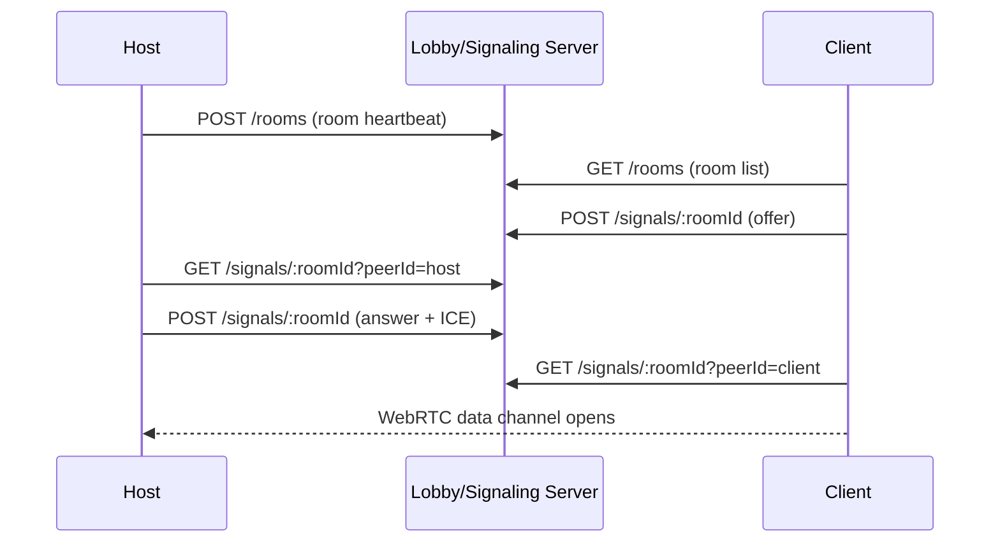
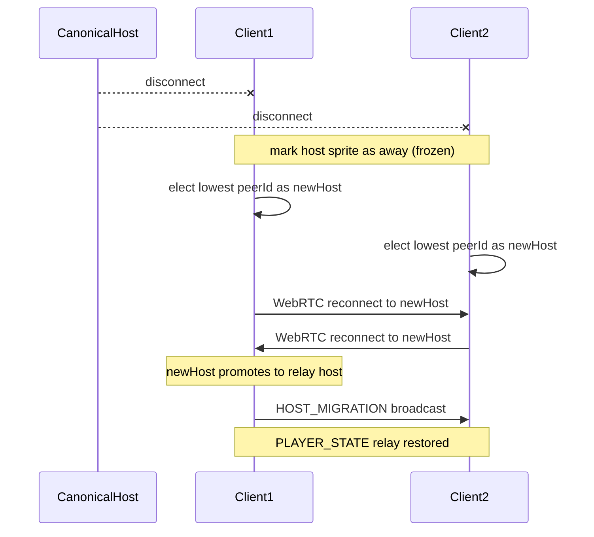

# Multiplayer Protocol

This document describes the current co-op flow for **G.L.O.S.S.A.R.Y.** Multiplayer is built around a lightweight lobby/signaling server plus browser-native WebRTC data channels. The server helps players find and connect to rooms; gameplay messages move peer-to-peer once the data channel is open.

---

## 1. Rooms & Lobby System

- **Room Types:** Players can create public rooms, private rooms, or play offline.
- **Auto-Generated Names:** Room titles combine thematic word lists from `constants.ts`.
- **Passcodes:** Every hosted room has a 6-character alphanumeric passcode (`A-Z`, `0-9`). Private rooms hide the passcode in the room list; open rooms expose it so joining can be one click.
- **Player Capacity:** 1-3 players.
- **Lobby Server:** `lobby-server.js` exposes `/rooms` for room discovery and `/signals/:roomId` for WebRTC signaling. It uses Node's built-in `http` module, CORS headers, and in-memory room/signal arrays.
- **Cleanup:** Room entries expire after 10 seconds without a host heartbeat. Signal messages expire after 30 seconds.

---

## 2. Connection & Signaling

The current implementation uses `RTCPeerConnection` directly, not PeerJS. The host creates a room id from the passcode, clients create temporary peer ids, and the lobby server relays `offer`, `answer`, and `ice` signal payloads while peers poll every 650 ms.

Once connected, `NetworkManager` emits `PEER_CONNECTED`, `PEER_DISCONNECTED`, and `NETWORK_DATA_RECEIVED` through `EventBus`. Hosts relay client-originated gameplay packets to the rest of the room.

---

## 3. Start Game & Shared Runes

- The host is the only player who can start a networked room.
- On start, the host unregisters the room, generates a shared rune seed in `MultiplayerData.generateSharedRunes`, and broadcasts `START_GAME`.
- All players enter the Covenant scene with the same shared rune payload.
- Each player still receives their covenant-specific unique rune:
  - **Dragon:** `P`
  - **Phoenix:** `I`
  - **Snake:** `E`
- Shared runes always include `A`, then five random runes excluding the covenant-only runes.

---

## 4. Covenant Waiting Room

- **Live Cursors:** `CURSOR_MOVE` packets stream pointer positions. Remote cursors are rendered as small `Graphics` triangles and interpolated locally.
- **Exclusive Locking:** Each covenant can only be locked by one player.
- **Authority:** Clients send `LOCK_REQUEST`; the host validates availability and broadcasts `COVENANT_LOCKED`.
- **Peer Metadata:** `NetworkManager` records peer covenant selections so later combat cohorts can identify each player by covenant.
- **Start Condition:** When the host sees every connected player locked in, it broadcasts `ALL_READY`. All players wait 0.5 seconds and then transition into `LevelScene`.

---

## 5. Exploration Sync

`LevelMultiplayerPresence` keeps players visible to one another during world exploration.

- Local movement state is broadcast every 100 ms as `PLAYER_STATE`.
- Payloads include map key, position, facing, movement state, covenant, and origin peer id.
- Remote players are only shown when they are on the same map.
- Remote sprites interpolate toward their latest target position and time out after 3.5 seconds without updates.
- Hosts rebroadcast received `PLAYER_STATE` messages so every connected client sees the same party presence.
- **Away peers:** When any player disconnects, their sprite is frozen at the last known position instead of being removed. The relay host broadcasts `PEER_LEFT` so every remaining client applies the ghost state, not only the machine that saw the WebRTC drop.

---

## 5a. Host Migration & Rejoin

When the canonical host (peer id = room id) disconnects mid-game, remaining clients elect a temporary relay host so gameplay sync continues.

- **Election:** `NetworkManager.electNewHost()` picks the lexicographically lowest known client peer id (excluding the canonical host id). Every client computes the same result.
- **`HOST_MIGRATION`:** Broadcast by the new temporary host after promotion so late reconnecting clients can align.
- **`HOST_RESTORED`:** Broadcast when the original host reconnects via **Continue**. The temporary host demotes back to client and all peers reconnect to the canonical host peer id.
- **`PEER_LEFT`:** Broadcast by the relay host when any client disconnects. All remaining clients freeze that player's sprite.
- **Lobby `hostPeerId`:** Room heartbeats include `hostPeerId` so clients can detect when the canonical host returns (`hostPeerId === roomId`) versus a temporary relay host. The lobby server must expose this field in `GET /rooms`.
- **Lobby heartbeat:** The temporary host registers room heartbeats using passcode metadata saved in `PlayerData` so the session stays discoverable.

### Continue Rejoin (Original Host)

When a networked game starts, `PlayerData` stores:

- `multiplayerPasscode` — room passcode
- `wasMultiplayerHost` — whether this player hosted
- `multiplayerRoomTitle` — lobby display title
- `multiplayerPeers` — party roster (`peerId` + covenant) for restoring covenant metadata after host rejoin

If the original host selects **Continue** on the main menu and `wasMultiplayerHost` is true, the game calls `NetworkManager.restoreAsCanonicalHost()` before loading `LevelScene` from the existing save. Covenant is skipped; rune and map progress come from the save file. The host registers lobby heartbeats with `hostPeerId` set to the canonical room id; remaining clients poll `GET /rooms` every second and reconnect when they detect the canonical host is back.

Session fields are cleared on new game or when explicitly leaving a room from the multiplayer menu.

---

## 6. Map & Raidho Rune Sync

The Central Hub Raidho rune is the current floor-advance gate.

- Combat completions fill the hub pipes and charge the rune.
- At 0, 1, and 2 completions, interacting with the rune displays short lore/status text.
- At 3 completions, holding interact triggers the teleport sequence.
- The teleport clears completed combat progress, advances `PlayerData.currentFloor`, closes the hub door again, and restarts the map.
- If the party has reached combat tier 3 on floor 3, the Raidho rune sends the party to `summit-settlement`; otherwise it loops back through the hub.
- Networked sessions broadcast this as `MAP_CHANGE`, including target map, floor state, hub-door state, and `teleportFromRune`.

---

## 7. Combat Start Sync

Combat entry is synchronized with `CombatStartSync`.

- The local scene builds a combat payload with a unique combat id, encounter tier, map key, enemy id, and combat cohort.
- The cohort includes the local player plus **currently connected** peer covenant selections (`getActiveCombatParticipants()`).
- Stale covenant lock-ins from disconnected players are excluded so solo or partial parties do not spawn ghost combat lanes.
- `COMBAT_START` is broadcast to other peers.
- Remote peers store their return location and launch the same combat transition.
- Hosts rebroadcast received combat starts to keep all clients aligned.
- Each client re-filters incoming cohort payloads against live connections when building the local roster.

---

## 8. Combat Rules

- Combat is turn-based and supports up to 3 **connected** players through the shared cohort payload.
- Turn resolution only waits for active connected allies; the wait indicator uses the live player count (for example `1/2`, not `1/3` when one peer is gone).
- If an ally disconnects mid-combat, that ally and their lane enemy are auto-forfeited so the remaining party can continue.
- Players retain their own covenant-derived HP and stats.
- Currency is not shared.
- Rune discovery and progression are shared at run start through the shared rune seed; local save data still stores each player's unlocked knowledge.
