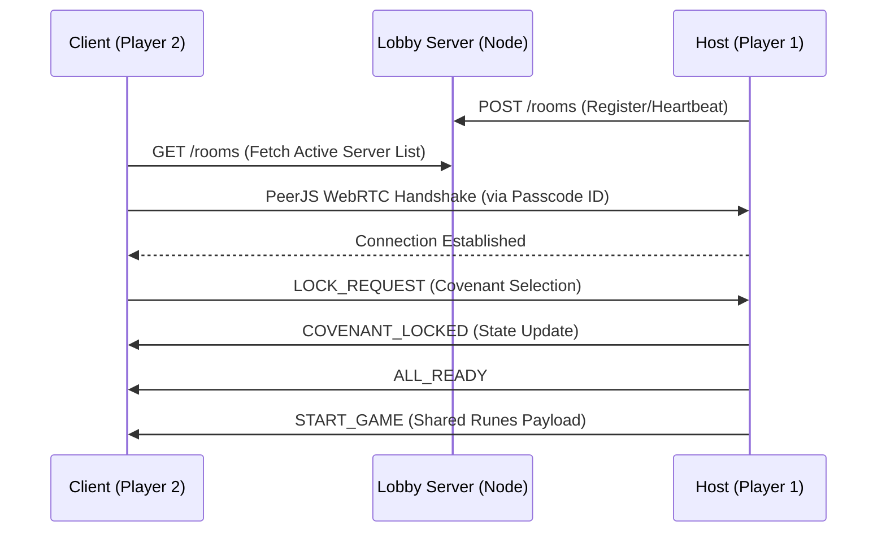

### Multiplayer Protocol

**1. Rooms & Lobby System**
- **Room Types:** Players can create public or private rooms, or choose to play alone.
- **Auto-Generated Names:** Room titles are automatically randomized by combining thematic words, creating a large number of unique possibilities. (e.g. "Silent Forest", "Whispering Cave", "Forgotten Temple").
- **Lobby Discovery Server:** A lightweight custom Node.js HTTP server (`lobby-server.js`) tracks active host sessions in real-time. It acts purely as a matchmaking list and cleans up inactive "ghost" servers via a 5-second interval heartbeat.
- **Secure Passcodes:** Private rooms automatically generate a secure 6-character alphanumeric passcode (`A-Z`, `0-9`). 
- **Player Capacity:** 1-3 Players.

**2. Covenant Selection (Live Waiting Room)**
- **Real-Time Sync:** The Covenant selection scene acts as a live waiting room. Players' mouse coordinates are continuously sent to the Host and broadcasted. Local clients use linear interpolation to display real-time dummy cursors (using drawn `Graphics` polygons) for other players.
- **Exclusive Locking:** Each player locks a different covenant.
- **State Management:** The Host maintains a central state of chosen Covenants.
- **Selection Flow:** When a player selects a Covenant, they emit a `LOCK_REQUEST`. The Host verifies availability, locks it, and broadcasts `COVENANT_LOCKED`. Clients locally tint the card dark grey and completely disable its interactive hit zone, preventing others from choosing it. The player who successfully locked it sees a unique thematic color glint.
- **Delayed Transition:** Once all players lock in, the Host broadcasts an `ALL_READY` event, and the game pauses for 0.5s before transitioning to the level map.

**3. Networking Infrastructure (Hybrid P2P & Discovery)**
- **Technology Choice:** The multiplayer implementation uses **PeerJS** for WebRTC Peer-to-Peer (P2P) connections, where one player acts as the Network Host.
- **Architecture Flow:**

- **Why P2P/Host:** Removes the need for expensive dedicated servers. The Host's machine acts as the authoritative truth, instantly pushing live updates (cursor movements, locked covenants, dropped loot) to connected peer clients with minimal latency.
- **Data Payload:** Messages are kept extremely small using minimal JSON structures (e.g., `{ type: 'CURSOR_MOVE', id: '...', x: 120, y: 50 }`) to ensure a smooth, high-tick-rate environment.

**4. Map Exploration & Shared Loot (Authoritative Host)**
- **Host Authority:** The Host holds the absolute master map configuration and state for all collectibles.
- **Loot Interaction:** When a player touches an item like a Rune, they do not collect it instantly. The client sends an action request (`take_item`) to the Host.
- **Global Sync:** The Host verifies if the item is still available. If accepted, it broadcasts an `item_taken` event to all players.
- **Visual Feedback:** Only upon receiving Host confirmation does the item smoothly fade out on everyone's screen simultaneously. This fundamentally prevents race conditions where network lag causes two players to grab the same rare item. Notification of Unlocked item is shown.
- **Shared Progression:** All acquired items, runes, and finds are shared among the team.

**5. Combat Mechanics**
- Combat is turn-based with all 3 Players participating.
- Players take turns attacking. Each attack can be different.
- The order of attack is random.
- All players have their own lives (100/70/1 hp - Depends on covenant).
- Currency is `NOT` shared.
- Encounter scaling strictly follows: 1 Player = 1 Enemy. (Except bosses - Which are buffed).