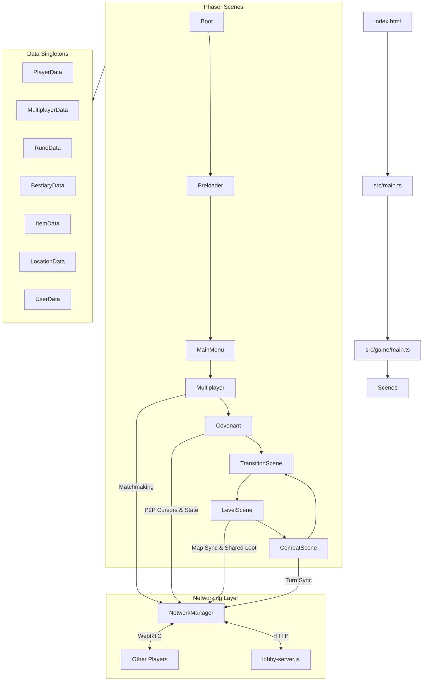

# Architecture & Folder Structure

This document outlines the architecture and project structure of G.L.O.S.S.A.R.Y.

<details>
<summary><b>📂 Root Directory</b></summary>

- `lobby-server.js` - A lightweight Node.js Express/HTTP server used for Multiplayer matchmaking and Room Discovery. Handles heartbeats and cleans up dead servers.
- `package.json` - Project dependencies and npm scripts.
- `index.html` - The main entry point for the Vite build.
- `GGD.md` - The comprehensive Game Design Document.
- `Multiplayer-Protocol.md` - Documentation of the P2P networking protocols and lobby logic.
</details>

<details>
<summary><b>📂 src/game (Core Architecture)</b></summary>

The primary game source code built with Phaser 3 and TypeScript.

- `main.ts` - Bootstraps the Phaser Game instance and registers all scenes.
- `constants.ts` - Global configuration variables (resolutions, frames, random names).
- `NetworkManager.ts` - Singleton handling PeerJS WebRTC connections, broadcasting messages, and communicating with the Lobby Server.
- `EventBus.ts` - Global event emitter for decoupled communication between scenes and data classes.
</details>

<details>
<summary><b>📂 src/game/data (State Management)</b></summary>

These classes act as centralized singletons or data registries for the game's state.

- `BestiaryData.ts` - Manages unlocked enemies and bestiary configurations.
- `ItemData.ts` - Manages unlocked artifacts and relics.
- `LocationData.ts` - Tracks discovered settlements and boss locations.
- `MultiplayerData.ts` - Handles lobby metadata, active rooms, and randomly generated shared runes for the session.
- `PlayerData.ts` - Core combat stats, HP, and Covenant selection.
- `RuneData.ts` - Manages the player's unlocked Rune inventory and combinatorial chain logic.
- `UserData.ts` - Tracks permanent meta-progression across runs.
</details>

<details>
<summary><b>📂 src/game/scenes (Game Scenes)</b></summary>

The modular states and UI layers of the application.

- `Boot.ts` & `Preloader.ts` - Initial asset loading and caching.
- `MainMenu.ts` - The entry screen and navigation hub.
- `Multiplayer.ts` - The server browser and lobby creation UI. Connects to `lobby-server.js`.
- `Covenant.ts` - The multiplayer waiting room where players lock in their characters/covenants and synchronize cursors via P2P.
- `LevelScene.ts` - The top-down exploration phase, handling tilemaps, collisions, and entity interaction.
- `CombatScene.ts` - The turn-based battle engine executing the Rune Chain mechanics.
- `GlossaryUI.ts` - The interactive lore book displaying discovered Runes, Bestiary, Items, and Maps.
- `TransitionScene.ts` - Handles visual fade-ins and fade-outs between scenes.
- `Help.ts` - In-game instructions and tutorial panels.
- `Settings.ts` / `SettingsUI.ts` - Game configuration overlays.
</details>

<details>
<summary><b>📂 public/assets (Static Assets)</b></summary>

All static files exposed to the web client.

- `exports/` - Contains subfolders for all specific sprites, animations, fonts, and UI elements.
- `exports/Boss/` - Boss and enemy spritesheets.
- `exports/Covenant/` - Character cards, backgrounds, and glint effects.
- `exports/Objects/` - Monoliths, treasures, and interactive props.
- `exports/UI/` - Fonts (`VCRosdNEUE.ttf`), cursor images, buttons, and layouts.
- `exports/tileset/` - Environment tilesets for the maps.
</details>

---

## Complete Folder Tree
```text
.
├── code
│   ├── check_png.html
│   ├── check_png.js
│   ├── convert_paths.js
│   ├── index.html
│   ├── LICENSE
│   ├── lobby-server.js
│   ├── log.js
│   ├── package.json
│   ├── package-lock.json
│   ├── public
│   │   ├── assets
│   │   │   └── exports
│   │   └── style.css
│   ├── README.md
│   ├── src
│   │   ├── game
│   │   │   ├── combat
│   │   │   ├── constants.ts
│   │   │   ├── data
│   │   │   ├── EventBus.ts
│   │   │   ├── main.ts
│   │   │   ├── NetworkManager.ts
│   │   │   ├── scenes
│   │   │   └── utils
│   │   ├── main.ts
│   │   └── vite-env.d.ts
│   ├── tsconfig.json
│   └── vite
│       ├── config.dev.mjs
│       └── config.prod.mjs
└── docs
    ├── ARCH.md
    ├── Game Design Document - G.L.O.S.S.A.R.Y.pdf
    ├── GGD.md
    ├── Multiplayer-Protocol.md
    └── Premise.md
```

## System Architecture Diagram


