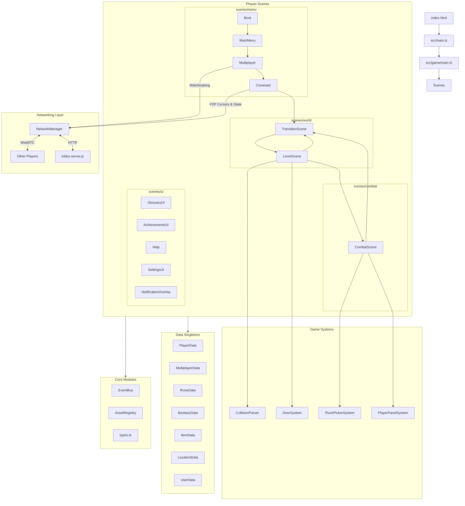

# Architecture & Folder Structure

This document outlines the architecture and project structure of G.L.O.S.S.A.R.Y.

<details>
<summary><b>📂 Root Directory</b></summary>

- `lobby-server.js` - A lightweight Node.js Express/HTTP server used for Multiplayer matchmaking and Room Discovery. Handles heartbeats and cleans up dead servers.
- `package.json` - Project dependencies and npm scripts.
- `index.html` - The main entry point for the Vite build.
</details>

<details>
<summary><b>📂 src/game (Core Architecture)</b></summary>

The primary game source code built with Phaser 3 and TypeScript.

- `main.ts` - Bootstraps the Phaser Game instance and registers all scenes. Configures `Scale.FIT` for pixel-perfect viewport scaling.
- `constants.ts` - Global configuration variables (resolutions, frames, random names, `FONT_FAMILY`).
- `types.ts` - Centralized type definitions (`CovenantType`, `CardType`, `EffectType`), depth/timing enums (`Depth`, `Timing`), and game constants (`TILE_SIZE`, `PLAYER_SPEED`, `SPAWN_OFFSET`, covenant color maps).
- `AssetRegistry.ts` - Typed string constants for all texture keys (`TextureKeys`), map keys (`MapKeys`), animation keys (`AnimationKeys`), and font keys (`FontKeys`).
- `EventBus.ts` - Global event emitter with typed `GameEvents` constants for decoupled communication between scenes and data classes.
- `NetworkManager.ts` - Singleton handling PeerJS WebRTC connections, broadcasting messages, and communicating with the Lobby Server.
</details>

<details>
<summary><b>📂 src/game/data (State Management)</b></summary>

These classes act as centralized singletons or data registries for the game's state.

- `BestiaryData.ts` - Manages unlocked enemies and bestiary configurations.
- `ItemData.ts` - Manages unlocked artifacts and relics.
- `LocationData.ts` - Tracks discovered settlements and boss locations.
- `MultiplayerData.ts` - Handles lobby metadata, active rooms, and randomly generated shared runes for the session.
- `PlayerData.ts` - Core combat stats, HP, Covenant selection, and the canonical `CovenantType` definition.
- `RuneData.ts` - Manages the player's unlocked Rune inventory and combinatorial chain logic.
- `UserData.ts` - Tracks permanent meta-progression across runs (achievements, settings, discovered items/runes/enemies).
</details>

<details>
<summary><b>📂 src/game/scenes (Game Scenes)</b></summary>

Scenes are organized into domain-specific subdirectories:

### `scenes/menu/` — Navigation & Flow
- `Boot.ts` - Initial asset loading and caching. Launches `NotificationOverlay` and `MainMenu`.
- `MainMenu.ts` - The entry screen and navigation hub with animated background and selector.
- `Multiplayer.ts` - The server browser and lobby creation UI. Connects to `lobby-server.js`.
- `Covenant.ts` - The multiplayer waiting room where players lock in their characters/covenants and synchronize cursors via P2P.

### `scenes/world/` — Exploration
- `LevelScene.ts` - The top-down exploration phase, handling tilemaps, collisions, portals, doors, and entity interaction. Delegates to `CollisionParser`, `DoorSystem`, and `GeometryUtils`.
- `TransitionScene.ts` - Handles visual fade-ins and fade-outs between scenes with a static `isPlaying` guard to prevent replay.

### `scenes/combat/` — Battle
- `CombatScene.ts` - The turn-based battle engine. Delegates rune chain mechanics to `RunePickerSystem` and ally display to `PlayerPanelSystem`.

### `scenes/ui/` — Overlays & UI
- `GlossaryUI.ts` - The interactive lore book displaying discovered Runes, Bestiary, Items, and Maps. Uses `ScrambleAnimation` for runic reveal effects.
- `AchievementsUI.ts` - Displays achievement progress and unlocked badges.
- `Achievements.ts` - Achievement scene launcher.
- `Help.ts` - In-game instructions and tutorial panels.
- `Settings.ts` / `SettingsUI.ts` - Game configuration overlays (VSync, controls).
- `ControlsUI.ts` - Key binding display overlay.
- `NotificationOverlay.ts` - Persistent notification toasts for achievements and discoveries.
</details>

<details>
<summary><b>📂 src/game/systems (Reusable Game Systems)</b></summary>

Extracted, focused modules that encapsulate specific game logic:

- `CollisionParser.ts` - Parses Tiled collision and stair object layers into Matter.js physics bodies (polygons, polylines, ellipses, rectangles).
- `DoorSystem.ts` - Door creation, interaction detection, cinematic opening animation, and collision body management.
- `RunePickerSystem.ts` - Rune picker layout, chain building, combo detection, and the converge-and-resolve animation sequence.
- `PlayerPanelSystem.ts` - Ally player icons with hover tooltips showing stats, chains, and covenant.
</details>

<details>
<summary><b>📂 src/game/utils (Shared Utilities)</b></summary>

Pure functions and lightweight helpers:

- `GeometryUtils.ts` - Polygon winding (clockwise enforcement), point deduplication, and sensor body creation for Tiled polygons.
- `ScrambleAnimation.ts` - Runic-to-text scramble reveal animation, cleanup lifecycle, and `convertToRunicWords` text transformer.
- `Vignette.ts` - Creates configurable vignette overlays (normal and dark variants).
- `ScreenShake.ts` - Camera shake utility.
- `AchievementNotification.ts` - Helper for showing rune discovery notifications.
- `Cat.ts` - Easter egg cat sprite with spin animation sequence.
</details>

<details>
<summary><b>📂 src/game/combat (Combat Logic)</b></summary>

- `CombatSystem.ts` - Core turn-based combat engine managing players, enemies, rounds, and chain resolution.
</details>

<details>
<summary><b>📂 public/assets (Static Assets)</b></summary>

All static files exposed to the web client.

- `exports/` - Contains subfolders for all specific sprites, animations, fonts, and UI elements.
- `exports/Animations/` - Door sheets and symbol overlays.
- `exports/Boss/` - Boss and protagonist spritesheets.
- `exports/characters/` - Enemy spritesheets (Cultist, Golem, Rationalist, Scavenger, Slime, Wisp).
- `exports/Covenant/` - Character cards, backgrounds, and glint effects.
- `exports/Maps/` - Tiled JSON map files (central-hub, boss floors, settlements).
- `exports/Objects/` - Monoliths, treasures, currency, items, glossary, and map outlines.
- `exports/UI/` - Fonts (`VCRosdNEUE.ttf`, `RUNE.TTF`), cursor images, buttons, layouts, transitions, and combat overlays.
- `exports/tileset/` - Environment tilesets (Abandoned, Desert, Mechanic, Summit, Objects).
</details>

---

## Complete Folder Tree
```text
src/game/
├── AssetRegistry.ts
├── EventBus.ts
├── NetworkManager.ts
├── constants.ts
├── types.ts
├── main.ts
│
├── combat/
│   └── CombatSystem.ts
│
├── data/
│   ├── BestiaryData.ts
│   ├── ItemData.ts
│   ├── LocationData.ts
│   ├── MultiplayerData.ts
│   ├── PlayerData.ts
│   ├── RuneData.ts
│   └── UserData.ts
│
├── scenes/
│   ├── combat/
│   │   └── CombatScene.ts
│   ├── menu/
│   │   ├── Boot.ts
│   │   ├── Covenant.ts
│   │   ├── MainMenu.ts
│   │   └── Multiplayer.ts
│   ├── ui/
│   │   ├── Achievements.ts
│   │   ├── AchievementsUI.ts
│   │   ├── ControlsUI.ts
│   │   ├── GlossaryUI.ts
│   │   ├── Help.ts
│   │   ├── NotificationOverlay.ts
│   │   ├── Settings.ts
│   │   └── SettingsUI.ts
│   └── world/
│       ├── LevelScene.ts
│       └── TransitionScene.ts
│
├── systems/
│   ├── CollisionParser.ts
│   ├── DoorSystem.ts
│   ├── PlayerPanelSystem.ts
│   └── RunePickerSystem.ts
│
└── utils/
    ├── AchievementNotification.ts
    ├── Cat.ts
    ├── GeometryUtils.ts
    ├── ScrambleAnimation.ts
    ├── ScreenShake.ts
    └── Vignette.ts
```

## System Architecture Diagram


